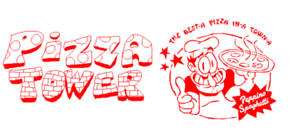
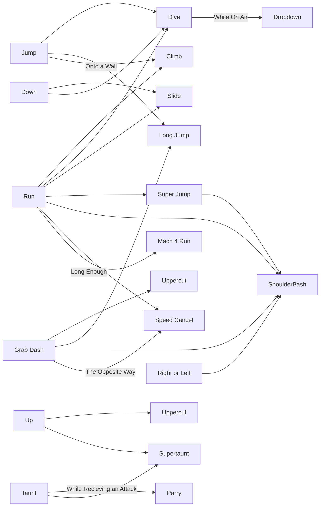

# Pizza Tower

SteamLink- [Link](https://store.steampowered.com/app/2231450/Pizza_Tower/)

**Description**
This Multiplatform game is a 2D platformer akin to the likes of WarioLand where the player must traverse multiple levels defeating bosses and reclaiming your reputation.

**Characters**

*Peppino Spaghetti* - The unhinged main character.

*Gustavo And Brick* -Peppino's friend and 2nd playable character.

*Pepperman* - 1st Boss and an egocentric artist.

*The Vigillante* - 2nd Boss a wildwest cheeseblob sherif.

*Theodore The Noise* - 3rd Boss and Pepinno's rival.

*Noisette* - Owner of Noisette's Cafe and Noise's girlfriend.

*Snotty* - Poor slime that when killed, will never rewspawn.

*Fake Peppino* - 4th Boss

*Pizzaface* - final Boss

*Pizzahead* - 2nd Phase of the final boss

*The Doise* - Noises' substitution in his campaign 

**História**

Peppino is in his pizzaria when Pizzaface (a pizza with a face) theatens him by tell him that he will destroy his pizzeria with a giant lasr located on to of his pizza tower.
Peppino now must get his way to the top of the tower to defeat Pizzaface and destroy the tower.

**The Complexety of the Controls**

by Gabriel Almeida a22403021
and Francisco Anjos a22204855